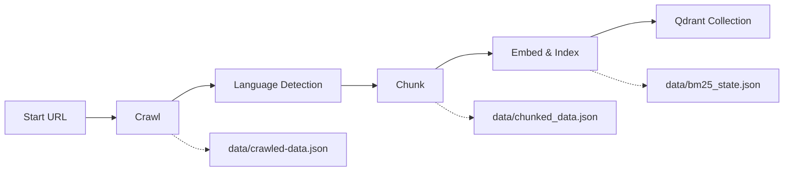

# Ingestion Workflow (Demo)

End-to-end pipeline that turns a website into searchable knowledge in Qdrant. Four linear steps run in order via a LangGraph workflow.

```
Crawl → Language Detection → Chunk → Embed & Index
```

---

## How to Run (Demo)

**API**

```http
POST /api/v1/pipeline/ingest
```

**CLI**

```bash
python -m scripts.ingest --url https://example.com --max-depth 2 --recreate
```

After ingestion completes, the cached retriever is refreshed so `/ask` and `/chat` can query the new index immediately.

---

## Pipeline Overview



| Step | Input | Output |
|------|-------|--------|
| 1. Crawl | Start URL | `data/crawled-data.json` |
| 2. Language | Crawled JSON | Updated `language` tags on each page |
| 3. Chunk | Crawled JSON | `data/chunked_data.json` |
| 4. Embed & Index | Chunked JSON | Qdrant collection + `data/bm25_state.json` |

---

## Step 1 — Crawl

**What it does**

- Discovers and fetches HTML pages from the start URL.
- Optionally follows and extracts linked PDFs.
- Saves each page as structured JSON (URL, markdown body, language hint, metadata).

**Logic applied**

| Area | Logic |
|------|-------|
| Discovery | **BFS deep crawl** (breadth-first) with configurable `max_depth` and `max_pages` |
| Crawler | **crawl4ai** headless browser; cache bypassed for fresh content |
| URL filtering | Excluded URL patterns and non-content selectors (nav, footer, widgets, images) stripped |
| HTML extraction | Page rendered → markdown; empty/icon-only links and extra blank lines cleaned |
| Initial language | Read from `<html lang="...">` when present (`ga` → Irish, `en` → English) |
| PDF discovery | `.pdf` links collected during HTML crawl |
| PDF extraction | HTTP fetch in memory → **pypdf** text extraction → markdown cleanup |
| Domain scope | By default, only same-domain links; `include_external` allows cross-domain |
| Persistence | Pages written to `data/crawled-data.json` when `save_json=true` |

---

## Step 2 — Language Detection

**What it does**

- Re-scans every crawled page and assigns or corrects a language tag before chunking.

**Logic applied**

| Area | Logic |
|------|-------|
| Input | Markdown body of each page in `crawled-data.json` |
| Detection | **Stopword scoring**: count Irish vs English function words in the text |
| Decision | Higher stopword count wins; ties or too-short text (< 20 tokens) → `unknown` |
| Update | Overwrites stored `language` when detection differs from crawl-time value |
| Output | Irish / English / unknown counts; file updated in place |

This step ensures chunk metadata carries a reliable language label for bilingual (Irish/English) content.

---

## Step 3 — Chunk

**What it does**

- Splits crawled pages into small, retrieval-ready **child chunks** with parent linkage and rich metadata.

**Logic applied**

### HTML pages

| Area | Logic |
|------|-------|
| Header split | **MarkdownHeaderTextSplitter** on `#`, `##`, `###` headings |
| Content blocks | Atomic units: headings, paragraphs (line-by-line), tables, lists, fenced code — **never split mid-block** |
| Parent chunks | Consecutive blocks merged greedily up to ~**2000 tokens** (tiktoken `cl100k_base` counter only; no LLM) |
| Child chunks | **One child chunk per content block** — paragraph/table/list/code stays intact |
| Metadata | `chunk_id`, `parent_chunk_id`, URL, title, language, header path, content type |

### PDF pages

| Area | Logic |
|------|-------|
| Splitter | **RecursiveCharacterTextSplitter** at ~800 characters, no overlap |
| Metadata | Same parent/child IDs and source fields as HTML chunks |

### Output

- Only **child chunks** are written to `data/chunked_data.json` (parents exist for retrieval expansion, not as separate indexed rows in this file).

---

## Step 4 — Embed & Index

**What it does**

- Converts child chunks into vectors and uploads them to **Qdrant** for hybrid (dense + sparse) search.

**Logic applied**

| Area | Logic |
|------|-------|
| Load | Read child chunks from `chunked_data.json` into LangChain `Document` objects |
| Dense vectors | **OpenAI `text-embedding-3-large`** (3072-dim) via batched API calls |
| Sparse vectors | **BM25** fitted on the full corpus (`k1=1.5`, `b=0.75`); state saved to `data/bm25_state.json` |
| Vector store | Qdrant collection (default: `teg_chunks`) with named **dense** and **sparse** vectors |
| Upload | Batched upsert with retries; optional `recreate=true` drops and rebuilds the collection |
| Post-run | Retriever cache invalidated so QA/chat uses the new index |

Requires `OPENAI_API_KEY` and a running Qdrant instance (default `http://localhost:6333`).

---

## Configuration (Demo Knobs)

| Parameter | Default | Effect |
|-----------|---------|--------|
| `url` | `WEBSITE_URL` from env | Crawl start page |
| `max_depth` | `2` | How many link levels beyond the start URL |
| `max_pages` | `500` | Cap on HTML pages crawled |
| `include_pdf` | `true` | Fetch and extract discovered PDFs |
| `include_external` | `false` | Follow links outside the start domain |
| `recreate` | `false` | Drop and recreate Qdrant collection before upload |
| `save_json` | `true` | Persist intermediate JSON artifacts under `data/` |

---

## Response Summary

A successful run returns an `IngestionResult` with per-step counts:

- **Crawl** — total / succeeded / failed pages
- **Language** — Irish / English / unknown / updated page counts
- **Chunk** — HTML and PDF chunk counts
- **Index** — documents uploaded, batches, collection name, whether collection was recreated

---

## What Happens Next (QA)

Indexed chunks power the **hybrid retriever** (dense + BM25) used by `/ask` and `/chat`. Retrieval can expand child hits to their parent chunk for broader context during answer generation.
