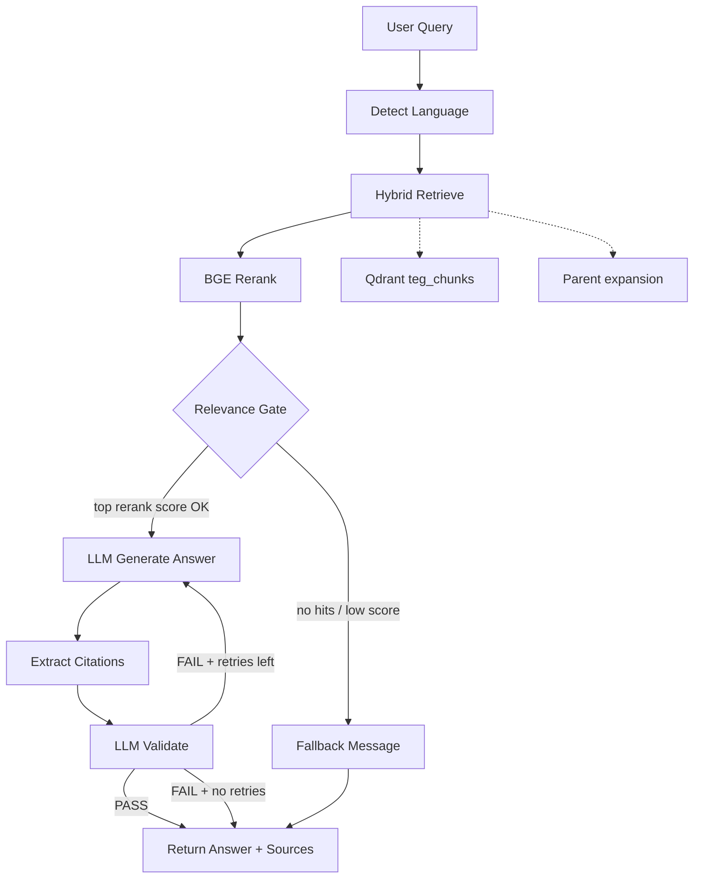

# Query Retrieval & LLM Answer Workflow (Demo)

End-to-end pipeline that takes a user question, retrieves relevant content from the indexed corpus, and generates a grounded answer with citations. Seven steps run via a LangGraph QA workflow (with one conditional branch and a validation retry loop).

```
Detect Language → Retrieve → Rerank → Relevance Gate → Generate Answer → Citations → Validate
                                              ↓ (low relevance)
                                          Fallback
```

**Prerequisite:** Ingestion must be complete (`data/chunked_data.json`, `data/bm25_state.json`, and the Qdrant collection must exist).

---

## How to Run (Demo)

**API**

```http
POST /api/v1/ask
Content-Type: application/json
Accept: text/event-stream

{
  "query": "What services does TEG provide?",
  "top_k": 10,
  "rerank_top_n": 5
}
```

The response is **Server-Sent Events** (`text/event-stream`):

| Event | Payload |
|-------|---------|
| `status` | `{ "type": "status", "step": "retrieve" \| "rerank" \| "generate" \| ... }` |
| `token` | `{ "type": "token", "content": "..." }` — streamed answer text |
| `done` | `{ "type": "done", "query", "answer", "language", "sources" }` |
| `error` | `{ "type": "error", "message": "..." }` |

**Final `done` event**

- `answer` — grounded reply (or canned fallback if context is too weak)
- `language` — detected query language (Irish or English)
- `sources` — cited pages/chunks with hybrid and rerank scores

---

## Pipeline Overview



| Step | Model / Component | Purpose |
|------|-------------------|---------|
| 1. Detect Language | Stopword scoring | Match answer language to query |
| 2. Retrieve | OpenAI embeddings + BM25 + Qdrant | Find candidate passages |
| 3. Rerank | `BAAI/bge-reranker-v2-m3` | Rescore for query–passage relevance |
| 4. Relevance Gate | Score threshold | Skip LLM when context is too weak |
| 5. Generate Answer | `gpt-4o-mini` | Grounded, cited reply |
| 6. Citations | Regex on `[n]` markers | Return only cited sources |
| 7. Validate | `gpt-4o-mini` | Check groundedness; retry if needed |

---

## Step 1 — Detect Language

**What it does**

- Detects whether the user asked in Irish or English so the answer can reply in the same language.

**Logic applied**

| Area | Logic |
|------|-------|
| Input | Raw user query string |
| Detection | **Stopword scoring** — count Irish vs English function words in the query |
| Decision | Higher count wins; ambiguous or short text defaults to **English** |
| Output | `language` field passed to answer generation and fallback messages |

---

## Step 2 — Hybrid Retrieve

**What it does**

- Searches the Qdrant index for the `top_k` most relevant passages (default **10**).

**Logic applied**

| Area | Logic |
|------|-------|
| Retriever | Cached **HybridRetriever** (built once per process, refreshed after ingestion) |
| Dense search | Query embedded with **OpenAI `text-embedding-3-large`** → cosine similarity in Qdrant |
| Sparse search | **BM25** sparse vector from persisted `data/bm25_state.json` |
| Fusion | Qdrant **hybrid mode** — dense + sparse combined by the vector store |
| Parent expansion | Matched **child chunk** is expanded to its full **parent section** (all sibling chunks under the same `parent_chunk_id`, ordered by `chunk_index`) |
| De-duplication | Same parent section returned only once even if multiple children matched |
| Context enrichment | Breadcrumb prepended: page title + header path (`#` / `##` / `###` hierarchy) |
| Output | List of hits: `chunk_id`, `score`, `content`, `metadata` |

This is **small-to-big retrieval**: search stays precise on fine-grained chunks; the LLM receives the wider surrounding section.

---

## Step 3 — Rerank

**What it does**

- Rescores retrieved hits and keeps only the top `rerank_top_n` (default **5**) for LLM context.

**Logic applied**

| Area | Logic |
|------|-------|
| Model | **`BAAI/bge-reranker-v2-m3`** cross-encoder (CPU, lazy-loaded singleton) |
| Scoring | Each `(query, passage)` pair scored jointly — reads query and content together |
| Truncation | Max passage length **512 tokens** for reranker input |
| Sorting | Hits reordered by `rerank_score` descending; top N kept |
| Output | Same hit shape plus `rerank_score` on each result |

---

## Step 4 — Relevance Gate

**What it does**

- Decides whether retrieved context is strong enough to answer, or whether to return a canned fallback.

**Logic applied**

| Area | Logic |
|------|-------|
| No results | Route directly to **fallback** |
| Score check | Compare **top `rerank_score`** against `rerank_relevance_threshold` (default **0.0**) |
| Pass | Continue to **generate answer** |
| Fail | Return bilingual canned message (English or Irish) — **no LLM answer call** |

---

## Step 5 — Generate Answer (LLM)

**What it does**

- Produces a concise, grounded answer using only the reranked context.

**Logic applied**

| Area | Logic |
|------|-------|
| Model | **`gpt-4o-mini`** at `temperature=0` |
| Context format | Numbered blocks `[1] Title (url)\ncontent` — one per reranked hit |
| System prompt | Answer **only** from provided context; cite inline as `[1]`, `[2][3]`; say "don't know" if insufficient |
| Language | Instructed to respond in detected query language (Irish or English) |
| Grounding rule | Must not invent facts or cite sources outside the numbered context |

---

## Step 6 — Citations

**What it does**

- Builds the `sources` list returned to the client.

**Logic applied**

| Area | Logic |
|------|-------|
| Parse answer | Regex extracts `[n]` citation markers from the generated text |
| Cited sources | Only reranked hits referenced by `[n]` are included (in citation order) |
| No citations in answer | Falls back to returning **all** reranked hits as sources |
| Source fields | `chunk_id`, `url`, `title`, hybrid `score`, `rerank_score` |

---

## Step 7 — Validate (LLM)

**What it does**

- Checks that the answer is faithful to the context and citations are valid.

**Logic applied**

| Area | Logic |
|------|-------|
| Model | **`gpt-4o-mini`** at `temperature=0` (separate validation prompt) |
| Checks | (1) Answer fully grounded — no invented facts; (2) every `[n]` refers to a valid context number |
| Verdict | Model replies **PASS** or **FAIL** (single word) |
| Retry loop | On **FAIL**, regenerate answer (up to `qa_max_validation_retries`, default **2**) |
| Exhausted retries | Return the last answer anyway |

---

## Configuration (Demo Knobs)

| Parameter | Default | Effect |
|-----------|---------|--------|
| `query` | required | User question (1–4000 chars) |
| `top_k` | `10` | Hybrid-search candidates to retrieve |
| `rerank_top_n` | `5` | Passages passed to the LLM as context |
| `rerank_relevance_threshold` | `0.0` | Minimum top rerank score to attempt an LLM answer |
| `qa_max_validation_retries` | `2` | Max answer regenerations when validation fails |

**Environment**

- `OPENAI_API_KEY` — embeddings (retrieve) and chat (answer + validate)
- Qdrant at `http://localhost:6333` (default collection: `teg_chunks`)

---

## End-to-End Example (Demo Narrative)

1. User asks: *"Cad iad na seirbhísí a chuireann TEG ar fáil?"*
2. Language detected → **Irish**
3. Hybrid search finds 10 child chunks across relevant pages → expanded to parent sections
4. BGE reranker keeps top 5 passages with highest query–passage scores
5. Relevance gate passes → LLM generates Irish answer citing `[1][2]`
6. Citations node returns only sources `[1]` and `[2]`
7. Validator confirms groundedness → response sent to client

If retrieval returns nothing useful, the user gets the Irish fallback: *"Níl go leor eolais agam bunaithe ar an ábhar atá ar fáil."* — without calling the answer LLM.

---

## Relation to Ingestion

| Ingestion produces | Retrieval uses |
|--------------------|----------------|
| Child chunks in Qdrant (dense + sparse vectors) | Hybrid search targets |
| `parent_chunk_id` on each chunk | Parent expansion at retrieve time |
| `data/bm25_state.json` | Sparse BM25 query encoding |
| Page title, URL, header path, language metadata | Breadcrumbs, citations, source cards |

See [ingestion-workflow.md](./ingestion-workflow.md) for how the index is built.
